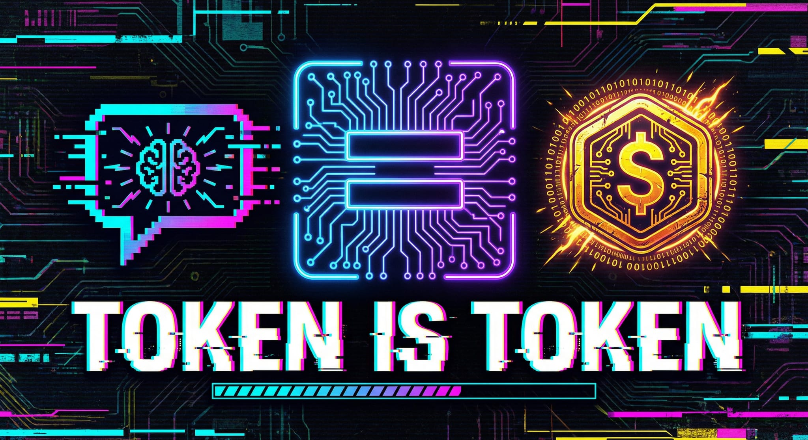

# LLM API Share Network

[中文](README.md) | [English](README_EN.md) | [日本語](README_JA.md) | [한국어](README_KO.md)

## **Token（LLM）即 Token（ERC20）**

每一次大模型 API 调用消耗的 Token，都将转化为区块链上的 ERC20 Token 价值。

---

### 🌟 愿景与使命

**LLM API Share Network** 是一个基于 **0G Chain** 构建的去中心化大语言模型 API Token 分享网络。我们的使命是打破地缘政治壁垒和金融结算限制，通过 Web3 技术实现全球 AI 资源的自由流通、低摩擦结算与价值共享。

### 📈 市场机会

随着 AI 技术的爆发式增长，全球 LLM 市场预计到 2033 年将达到 **$82B+**。然而，由于地缘政治和金融政策的限制，全球有超过 **1100 万** 潜在用户（开发者、企业、创作者）面临着 AI 服务分割、跨境支付困难等挑战。我们致力于填补这一市场空白。

### 💎 核心价值主张

| 维度 | 传统模式痛点 | 我们的解决方案 |
| :--- | :--- | :--- |
| **全球可用性** | 地理位置限制导致部分模型无法访问 | 通过全球去中心化节点网络中转，实现资源共享 |
| **低摩擦结算** | 跨境支付困难、汇率风险、银行限制 | 使用 ERC20 Token 作为统一、即时的结算单位 |
| **资源优化** | 个人或企业月度配额闲置浪费 | 通过 Token 激励机制，分享闲置配额获取收益 |
| **透明可信** | 代理服务不透明、安全性差 | 基于区块链的用量记录与智能合约自动结算 |

### ⚙️ 如何工作

项目通过连接 **供给方（Provider）** 与 **需求方（Consumer）**，构建一个高效的 AI 资源中继网络：

1.  **供给方 (Provider)**: 分享其拥有的 LLM API 配额（如 Claude, GPT, Gemini, Seedance 等），运行 Provider 节点。
2.  **需求方 (Consumer)**: 使用 ShareToken (SHARE) 支付 API 调用请求。
3.  **P2P 网络**: 请求通过去中心化 P2P 网络路由，确保高效、稳定的转发。
4.  **实时结算**: 智能合约根据实际消耗的 LLM Token 数量，实时铸造并分配 SHARE 代币。

### 🪙 代币经济：ShareToken (SHARE)

SHARE 是网络的灵魂，采用创新的**动态发行模型**：

-   **发行机制**: 无人为上限，产量完全由网络实际 API 调用量驱动。
-   **分配比例**:
    -   **85%** 分配给供给方（Provider），作为分享资源的直接奖励。
    -   **10%** 进入协议国库，用于生态发展与长期运营。
    -   **5%** 用于流动性激励，确保交易深度。
-   **核心逻辑**: 消耗即铸造，价值与使用量深度绑定。

### 🏗️ 技术架构

系统深度集成 **0G Chain** 生态，确保高性能与低成本：

-   **0G Chain**: 提供 11,000 TPS 与亚秒级最终确认，完美支持高频 API 结算。
-   **0G Storage**: 去中心化存储 API 调用日志，成本比传统云服务低 95%。
-   **P2P Network**: 基于 libp2p 构建的健壮中继网络。
-   **Provider Node**: 轻量级客户端，支持多平台部署，一键分享配额。

### 🔗 社交链接

-   **Twitter/X**: [Coming Soon](#)
-   **Discord**: [Coming Soon](#)
-   **Telegram**: [Coming Soon](#)
-   **Official Website**: [Coming Soon](#)

---

*注：本项目处于早期开发阶段，所有信息以最终发布的白皮书为准。*
